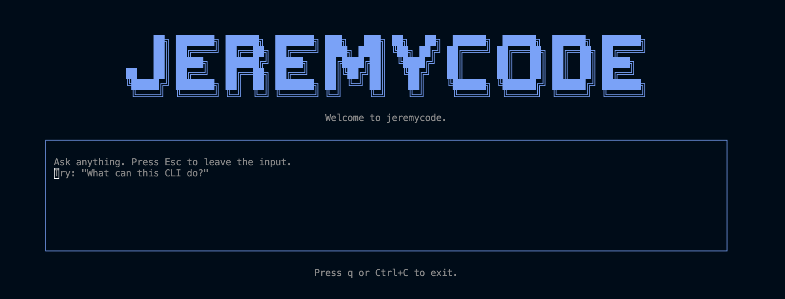

# Bun Hono OpenTUI Monorepo

A minimal Bun workspace monorepo with a Hono server and an OpenTUI CLI.

## Requirements

- [Bun](https://bun.sh) 1.3 or later

## Packages

| Package | Description |
| --- | --- |
| [`apps/server`](./apps/server) | Lightweight Hono HTTP server running on Bun. |
| [`apps/cli`](./apps/cli) | OpenTUI CLI that calls the server through a fully-typed RPC client. |
| [`packages/shared`](./packages/shared) | Tiny workspace of shared constants (e.g. `JEREMYCODE_NAME`). |



## Getting Started

Install all workspace dependencies from the repository root:

```sh
bun install
```

Start the Hono development server at <http://localhost:3000>:

```sh
bun run dev:server
```

Start the OpenTUI CLI:

```sh
bun run dev:cli
```

Press `q` or `Ctrl+C` to exit the CLI. The server exposes `GET /` and `GET /health`. The CLI renders the home screen shown at the top of the README.

## Typed RPC Client

The CLI consumes the server through [Hono's typed RPC client](https://hono.dev/docs/client/typescript):

- The server keeps its Hono routes and the `AppType` type in
  [`apps/server/src/app.ts`](./apps/server/src/app.ts), exposed under the
  `./app` subpath of `@bun-hono-opentui/server`. The root entry
  ([`apps/server/src/index.ts`](./apps/server/src/index.ts)) is the Bun
  bootstrap that listens on a port.
- The CLI's [`apps/cli/src/lib/client.ts`](./apps/cli/src/lib/client.ts)
  builds a typed client with
  `hc<AppType>(Bun.env.API_URL ?? "http://localhost:3000")`. Routes
  are autocompleted and the response type is inferred from the server
  handler.
- The CLI's About route demonstrates this end to end: it calls
  `api.health.$get()` on mount and renders the live `/health` result.
  Open the CLI and press the nav bar or type `/about` to see it.

Point the CLI at a different server by setting `API_URL`, for example:

```sh
API_URL=http://localhost:3010 bun run dev:cli
```

Because `AppType` is imported as `import type` from the server's
`./app` subpath, the server bootstrap module never enters the CLI
bundle, and the server package is listed under `devDependencies` of
the CLI to reflect that.

## Scripts

| Command | Description |
| --- | --- |
| `bun run dev:server` | Run the server with file watching. |
| `bun run dev:cli` | Run the CLI with file watching. |
| `bun run start:server` | Run the server once. |
| `bun run start:cli` | Run the CLI once. |
| `bun run typecheck` | Type-check every workspace package. |

## TypeScript

Shared compiler settings are defined in [`tsconfig.base.json`](./tsconfig.base.json). Each workspace package has its own `tsconfig.json` that extends this base configuration and includes only its own source files.

The server package splits the Hono app definition (`src/app.ts`) from the Bun bootstrap (`src/index.ts`) so that the typed RPC client on the CLI side only needs the former. See `AGENTS.md` for the full workspace package layout.

## Contributing

See [CONTRIBUTING.md](./CONTRIBUTING.md) for the development workflow and contribution guidelines.

## License

This project is licensed under the [Apache License 2.0](./LICENSE).
